Saturday Analysis
================
7/4/2021

-   [Packages required to load and analyse the
    data](#packages-required-to-load-and-analyse-the-data)
-   [SAT Report](#sat-report)
    -   [Introduction](#introduction)
    -   [Data preparation](#data-preparation)
    -   [Train/Test split](#traintest-split)
    -   [Data Summarizations and
        discussions](#data-summarizations-and-discussions)
        -   [Overall Count](#overall-count)
        -   [Weather Condition](#weather-condition)
        -   [Seasons](#seasons)
        -   [Temperature and Feeling
            Temperature](#temperature-and-feeling-temperature)
        -   [Humidity](#humidity)
        -   [Wind Speed](#wind-speed)
    -   [Modeling](#modeling)
        -   [Linear Regression Model](#linear-regression-model)
        -   [Ensemble Tree Model](#ensemble-tree-model)
        -   [Model Comparison](#model-comparison)

``` r
knitr::opts_chunk$set(fig.path='Figs/')
```

# Packages required to load and analyse the data

The following packages are needed for reading and analyzing the data:

readr, ggplot2, dplyr, knitr, caret, tidyr, lubridate, forcats, leaps,
regclass, MASS, gbm, boot

# SAT Report

## Introduction

In this project we decided to present an analysis report about bike
sharing data. The data comes from the UCI Machine Learning Repository,
contains the hourly and daily count of rental bikes between years 2011
and 2012 in Capital bikeshare system with the corresponding weather and
seasonal information. 731 days of data were collected.

We would like to explore if the weather and season factors may affect
the number of users. We aim to develop accurate models by both linear
regression and ensemble tree.

The following 13 characteristics were collected for each days along with
the count of casual/registered users.

`Date`

`Season`: Winter, spring, summer and fall.

`Year`: 2011 and 2012.

`Month`

`Hour`

`Holiday`: Weather day is holiday or not.

`Weekday`

`workingday`: if day is neither weekend nor holiday is 1, otherwise is
0.

`Weathersit`: 4 levels from smooth to terrible.

`Temperature`: Normalized.

`Feeling temperature`: Normalized.

`Humidity`: Normalized.

`Windspeed`: Normalized.

## Data preparation

Reading in the data using a relative path

``` r
day_data  <-  read_csv("day.csv")
```

Converting the weekday variable to a factor containing the 7 days of the
week:

``` r
day_as_fac_data <- day_data %>%
    mutate(week_day = wday(weekday +1,label=TRUE,locale="English_United States")) 
day_as_char_data <- day_as_fac_data %>% mutate_if(is.factor, as.character)
```

Converting the year, season, and weather situation variables:

``` r
#categorizing the season variable as factor
day_as_char_data <- mutate(day_as_char_data, Season = 
                  ifelse(season == 1, "Winter",
                  ifelse(season == 2, "Spring",
                  ifelse(season == 3, "Summer",
                  ifelse(season == 4, "Fall", "")))))
day_as_char_data$Season <- factor(day_as_char_data$Season, levels=c("Winter","Spring", "Summer","Fall"))

#categorizing the year variable as factor
day_as_char_data <- mutate(day_as_char_data, Year = 
                  ifelse(yr == 0, "2011",
                  ifelse(yr == 1, "2012", "")))
day_as_char_data$Year <- factor(day_as_char_data$Year, levels=c("2011","2012"))

#categorizing the weathersit variable as factor
day_as_char_data <- mutate(day_as_char_data, weather_situation = 
                  ifelse(weathersit == 1, "Clear Weather",
                  ifelse(weathersit == 2, "Misty/Cloudy Weather",
                  ifelse(weathersit == 3, "Light Snow/Rain/Thunderstorm Weather",
                  ifelse(weathersit == 4, "Heavy Rain/Snow/Fog/Icy Weather", "")))))
day_as_char_data$weather_situation <- factor(day_as_char_data$weather_situation, levels=c("Clear Weather","Misty/Cloudy Weather", "Light Snow/Rain/Thunderstorm Weather","Heavy Rain/Snow/Fog/Icy Weather"))


#reordering the day_data and renaming mth, cnt and hum
day_as_char_data <- day_as_char_data %>% dplyr::select(-c("instant")) %>% rename(month = mnth,count = cnt,humidity = hum)
```

``` r
day_as_char_data$count_cat  <-  ifelse(day_as_char_data$count >= 5000, "High", "Low")
```

Setting up the dataset for later automation. The code will be automated
to analysis data for the day from the day: “weekday” seen in the YAML
header:

``` r
data_weekday <- day_as_char_data %>% 
  filter(day_as_char_data$week_day == params$day)
 data_weekday$count_cat <- as.factor(data_weekday$count_cat)
```

## Train/Test split

Doing a 70:30 split for training/testing:

``` r
set.seed(365)
train  <-  sample(1:nrow(data_weekday), size = 0.7*nrow(data_weekday))
test  <- setdiff(1:nrow(data_weekday), train)
day_data_Train <- data_weekday[train, ]
day_data_Test <- data_weekday[test, ]
```

## Data Summarizations and discussions

### Overall Count

The averages for selected variables for each year is shown below

``` r
grouped_mean  <-  day_data_Train %>%
  group_by(Year) %>%
  summarise(
    n=n(),
    avg_registered_user = round(mean(registered), 0),
    avg_casual_user = round(mean(casual), 0),
    avg_windspeed = round(mean(windspeed*67), 2),
    avg_humidity = round(mean(humidity*100), 2),
  )

kable(grouped_mean, caption="Averages of selected variables for each year")
```

| Year |   n | avg\_registered\_user | avg\_casual\_user | avg\_windspeed | avg\_humidity |
|:-----|----:|----------------------:|------------------:|---------------:|--------------:|
| 2011 |  36 |                  2160 |              1018 |          13.80 |         61.12 |
| 2012 |  37 |                  3827 |              1741 |          13.09 |         58.93 |

Averages of selected variables for each year

The standard deviations by year for each of the variables above are
summarized below.

``` r
grouped_sd  <-  day_data_Train %>%
  group_by(Year) %>%
  summarise(
    n=n(),
    avg_registered_user = round(sd(registered), 0),
    avg_casual_user = round(sd(casual), 0),
    avg_windspeed = round(sd(windspeed*67), 3),
    avg_humidity = round(sd(humidity*100), 3),
  )
  
kable(grouped_sd, caption="Standard deviation of selected variables for each year")
```

| Year |   n | avg\_registered\_user | avg\_casual\_user | avg\_windspeed | avg\_humidity |
|:-----|----:|----------------------:|------------------:|---------------:|--------------:|
| 2011 |  36 |                   997 |               729 |          5.371 |        15.838 |
| 2012 |  37 |                  1203 |               983 |          5.507 |        12.274 |

Standard deviation of selected variables for each year

### Weather Condition

The table for weather condition vs. year for this particular day is
shown below:

``` r
year_season_table <- table(day_data_Train$Year, day_data_Train$weather_situation )
kable(year_season_table, caption="Table of Year vs. Weather situation")
```

|      | Clear Weather | Misty/Cloudy Weather | Light Snow/Rain/Thunderstorm Weather | Heavy Rain/Snow/Fog/Icy Weather |
|:-----|--------------:|---------------------:|-------------------------------------:|--------------------------------:|
| 2011 |            24 |                   10 |                                    2 |                               0 |
| 2012 |            26 |                   11 |                                    0 |                               0 |

Table of Year vs. Weather situation

This is visualized below:

``` r
ggplot(data=day_data_Train, aes(x=day_data_Train$Year))+
  geom_bar(aes(fill=as.factor(day_data_Train$weather_situation)))+ 
  labs(x="Year", title="Weather situation by year for this week day")+ 
  scale_fill_discrete(name="Weather situation", labels=c("Clear Weather","Misty/Cloudy Weather", "Light Snow/Rain/Thunderstorm Weather","Heavy Rain/Snow/Fog/Icy Weather")) 
```

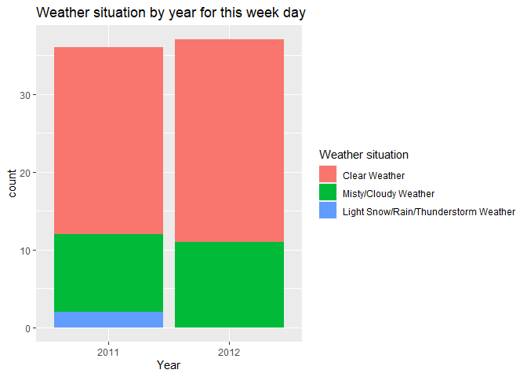<!-- -->

This bar plot shows the weather pattern for this particular day in 2011
and 2012.

We can also see if for a given year, weather condition has an effect on
the number of rentals for this week day

``` r
ggplot(data=day_data_Train, aes(x=weather_situation, y= count))+
  geom_boxplot(aes(fill=weather_situation))+
  labs(x="Weather Situation", y="Total number of rentals", fill="Weather Situation", title = "Boxplot of Total number of rentals by Weather condition for this week day")+  theme(axis.text.x = element_text(size  = 10,angle = 45,hjust = 1,vjust = 1)) 
```

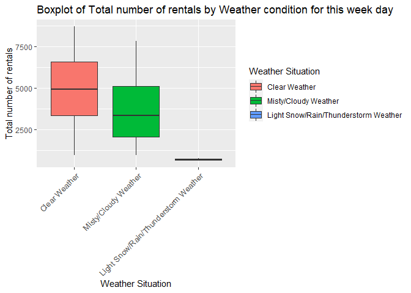<!-- -->

### Seasons

The number of casual and registered users on this particular day from
2011-2012 are categorized below:

``` r
#categorizing the number casual users as factor
day_data_Train <- mutate(day_data_Train, casual_format = 
                  ifelse(casual %in% 0:1000, "Low number of casual users",
                  ifelse(casual %in% 1000:2000, "Medium number of casual users",
                  ifelse(casual > 2000, "High number of casual users", ""))))
day_data_Train$casual_format <- factor(day_data_Train$casual_format, levels=c("Low number of casual users","Medium number of casual users", "High number of casual users"))

#categorizing the number registered users as factor
day_data_Train <- mutate(day_data_Train, registered_format = 
                  ifelse(registered %in% 0:2000, "Low number of registered users",
                  ifelse(registered %in% 2000:4000, "Medium number of registered users",
                  ifelse(registered > 4000, "High number of registered users", ""))))
day_data_Train$registered_format <- factor(day_data_Train$registered_format, levels=c("Low number of registered users","Medium number of registered users", "High number of registered users"))
```

The number of casual users vs season for 2011-2012 are shown in the
table and bar chart below:

``` r
casual_users_table <- table(day_data_Train$casual_format, day_data_Train$Season )
kable(casual_users_table, caption="Casual users vs Season for 2011-2012")
```

|                               | Winter | Spring | Summer | Fall |
|:------------------------------|-------:|-------:|-------:|-----:|
| Low number of casual users    |     17 |      4 |      1 |    9 |
| Medium number of casual users |      2 |      7 |      7 |    5 |
| High number of casual users   |      0 |     10 |      6 |    5 |

Casual users vs Season for 2011-2012

``` r
ggplot(data=day_data_Train, aes(x=day_data_Train$Season))+
  geom_bar(aes(fill=as.factor(day_data_Train$casual_format)))+ 
  labs(x="Season", title="Casual users vs Season for this week day from 2011-2012")+ 
  scale_fill_discrete(name="Casual Users", labels=c("Low number of casual users","Medium number of casual users", "High number of casual users")) + 
  coord_flip()
```

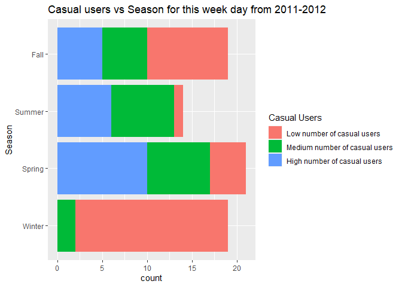<!-- -->

The same information for number of registered users is shown in the
table and bar chart below:

``` r
registered_users_table <- table(day_data_Train$registered_format, day_data_Train$Season )
kable(registered_users_table, caption="Registered users vs Season for 2011-2012")
```

|                                   | Winter | Spring | Summer | Fall |
|:----------------------------------|-------:|-------:|-------:|-----:|
| Low number of registered users    |     13 |      4 |      0 |    3 |
| Medium number of registered users |      6 |     11 |      8 |    7 |
| High number of registered users   |      0 |      6 |      6 |    9 |

Registered users vs Season for 2011-2012

``` r
ggplot(data=day_data_Train, aes(x=day_data_Train$Season))+
  geom_bar(aes(fill=as.factor(day_data_Train$registered_format)))+ 
  labs(x="Season", title="Registered users vs Season for this week day from 2011-2012")+ 
  scale_fill_discrete(name="Registered Users", labels=c("Low number of registered users","Medium number of registered users", "High number of registered users")) + 
  coord_flip()
```

<!-- -->

We can inspect the trend of casual and registered users across seasons
to see if there is a seasonal effect present.

Next, it would be nice to see how total bike rentals vary by season and
weather situation for this particular day.

``` r
ggplot(data=day_data_Train, aes(x=Season, y= count))+
  geom_boxplot(aes(fill=Season))+
  labs(x="Season", y="Total number of rentals", fill="Season", title = "Boxplot of Total number of rentals by Season for this week day")
```

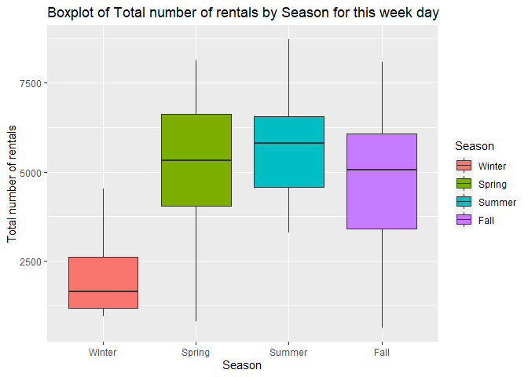<!-- -->

This plot will let us know if there is a seasonal effect on number of
rentals for this particular week day.

### Temperature and Feeling Temperature

We are curious about how difference is between temperature and feeling
temperature, so we decided to make a comparison line plot.

``` r
tem_plot <- day_data_Train %>%
  dplyr::select(dteday, temp, atemp, Year, count) %>%
  gather('temp','value',2:3)

ggplot(tem_plot) + geom_line(aes(x=dteday,y=value,color=temp)) + facet_wrap(~Year, scales = 'free') + theme_bw() + scale_colour_discrete(name = '', labels=c('temp','feeling temp')) + labs(x='Date', y='Temp', title = 'Temperature vs. feeling temperature')
```

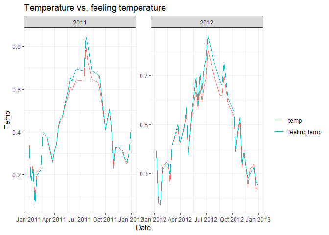<!-- -->

There’s no significant difference between these 2 variables from the
first look, so we decided to explore them deeply. First we want to
output the numeric summary of `temperature` and `feeling temperature`.

``` r
temp_out <- day_data_Train %>% 
  dplyr::select(temp,atemp)
apply(temp_out,2, summary) %>%
  kable(caption = 'Temperature vs Feeling Temperature', digits = 2, col.names = c('Temperature','Feeling Temperature'))
```

|         | Temperature | Feeling Temperature |
|:--------|------------:|--------------------:|
| Min.    |        0.06 |                0.08 |
| 1st Qu. |        0.32 |                0.32 |
| Median  |        0.41 |                0.41 |
| Mean    |        0.46 |                0.44 |
| 3rd Qu. |        0.63 |                0.59 |
| Max.    |        0.86 |                0.80 |

Temperature vs Feeling Temperature

From the numeric summary, we noticed that the variance of `temperature`
is a little bit wider than `feeling temperature`. It looks like these 2
variables do distributed pretty close, but in order to get statistical
support, we still need a 2 sample t-test.

``` r
T_test <- t.test(day_data_Train$temp, day_data_Train$atemp, alternative = 'two.sided')
T_test
```

    ## 
    ##  Welch Two Sample t-test
    ## 
    ## data:  day_data_Train$temp and day_data_Train$atemp
    ## t = 0.58632, df = 142.23, p-value = 0.5586
    ## alternative hypothesis: true difference in means is not equal to 0
    ## 95 percent confidence interval:
    ##  -0.04139274  0.07630085
    ## sample estimates:
    ## mean of x mean of y 
    ## 0.4584907 0.4410366

The p-value is about 0.5585919, which is pretty large, so we don’t have
enough evidence to reject the null hypothesis.

We decided to drop one of them due to the consideration of collinearity.
Since the variance of `temperature` is a little bit larger than
`feeling temperature`, we may expect `temperature` to be more sensitive
when fitting the model, so we decided to drop `feeling temperature` in
some of our models.

### Humidity

We would like to explore the general relationship between humidity and
users count.

``` r
hum_plot <- day_data_Train %>%
  dplyr::select(humidity, casual, registered, Year) %>%
  gather('regist', 'count', 2:3)

ggplot(data = hum_plot, aes(x=humidity, y=count, group=regist)) + geom_point(aes(color=regist)) + geom_smooth(aes(group=regist), color='black') + facet_wrap(~Year, scales = 'free') + theme_bw() + scale_colour_discrete(name = '') + labs(title = 'Relationship between Humidity and User Count')
```

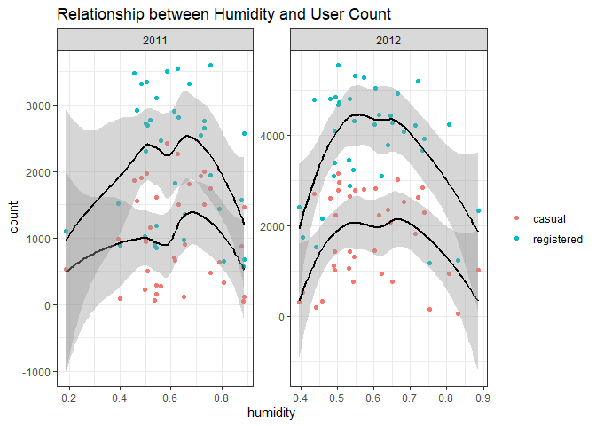<!-- -->

We can inspect the relationship of users with humidity using this plot
roughly. The points are nearly evenly distributed, which means humidity
can seldom affect the users if we control all other variables.

We added a categorical variable for original data set with 2 levels, one
level is for those whose daily total count over than 5000; and another
one is for smaller than 5000. We wish to see the numeric summary of
humidity among these 2 groups.

``` r
temp_out <- day_data_Train %>% 
  dplyr::select(humidity, count_cat)

index <- temp_out$count_cat=='Low'

output <- data.frame(cbind(summary(temp_out$humidity[index]),summary(temp_out$humidity[-index])))

output %>%
  kable(caption = 'Numeric Summary for Humidity vs Count', digits = 2, col.names = c('Less than 5000','Greater than 5000'))
```

|         | Less than 5000 | Greater than 5000 |
|:--------|---------------:|------------------:|
| Min.    |           0.19 |              0.19 |
| 1st Qu. |           0.50 |              0.50 |
| Median  |           0.54 |              0.58 |
| Mean    |           0.60 |              0.60 |
| 3rd Qu. |           0.73 |              0.71 |
| Max.    |           0.89 |              0.89 |

Numeric Summary for Humidity vs Count

### Wind Speed

``` r
ggplot(data = day_data_Train, aes(x=windspeed, y=..density..)) + geom_histogram(bins = 20) + geom_density(size=2.5,color='red',adjust=1/3) + facet_wrap(~Year, scales = 'free') + theme_bw()
```

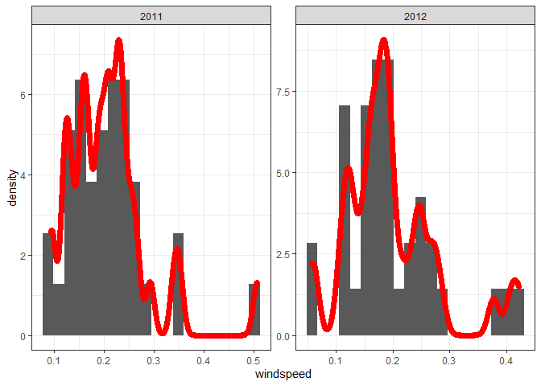<!-- -->

This plot shows the distribution of windspeed. Although the number of
samples is small, it still shows a certain degree of normality.

Same as humidity, we are curious about the relationship between
windspeed and user count after controlled all other variables.

``` r
wind_plot <- day_data_Train %>%
  dplyr::select(windspeed, casual, registered, Year) %>%
  gather('regist', 'count', 2:3)

ggplot(data = wind_plot, aes(x=windspeed, y=count, group=regist)) + geom_point(aes(color=regist)) + geom_smooth(aes(group=regist), color='black') + facet_wrap(~Year, scales = 'free') + theme_bw() + scale_colour_discrete(name = '') + labs(title = 'Relationship between Windspeed and User Count')
```

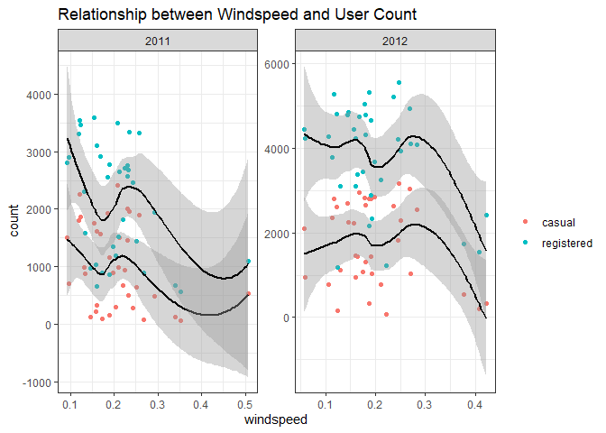<!-- -->

We can inspect the relationship of users with windspeed using this plot
roughly.

Below shows the numeric information for wind speed.

``` r
windspeed_summmary <- day_data_Train %>% 
  dplyr::select(season, windspeed) %>%
  group_by(season) %>%
  summarise(
    Min = min(windspeed),
    '1st Qu.' =  quantile(windspeed, 0.25),
    Median = median(windspeed),
    '3rd Qu.' = quantile(windspeed, 0.75),
    Max = max(windspeed),
  )

windspeed_summmary %>%
  knitr::kable(digits = 2, caption = 'Numeric Summary for Windspeed')
```

| season |  Min | 1st Qu. | Median | 3rd Qu. |  Max |
|-------:|-----:|--------:|-------:|--------:|-----:|
|      1 | 0.12 |    0.17 |   0.19 |    0.24 | 0.51 |
|      2 | 0.12 |    0.13 |   0.19 |    0.23 | 0.34 |
|      3 | 0.11 |    0.16 |   0.17 |    0.20 | 0.25 |
|      4 | 0.06 |    0.11 |   0.22 |    0.26 | 0.38 |

Numeric Summary for Windspeed

## Modeling

### Linear Regression Model

Linear regression modeling is one of the supervised learning methods
where the output is known, and the goal is to establish a function that
best approximates the relationship between desired outputs and the
provided sample data. Specifically, linear regression accomplishes this
by learning a model that best fits the linear relationship between the
predictor and response variables.The model is fit by minimizing the sum
of squared residuals (difference between the observed and predicted
responses). Linear regression models fall into two categories: Simple
Linear Regression and Multiple Linear Regression.

Simple Linear Regression Model is one where there is only one
independent variable (or predictor) and the goal is to learn the linear
relationship between it and the response variable. Multiple Linear
Regression (MLR) has more than one predictor, and the although
relationship between predictors and response remains linear in terms of
the model parameters, the MLR model could contain interaction, quadratic
and polynomial terms.

Underlying assumptions for the linear regression model are  
\* Linearity: The model is linear in model parameters (betas) (Can be
checked using histogram or Q-Q plots)  
\* Normality: The predictor and response variables are multivariate
normal  
\* Multicollinearity: There is little to no multicollinearity among the
predictor variables. (can be checked using Variance Inflation Factor)  
\* Homoscedasticity: Residuals are randomly distributed across the
regression line (Can be checked using the Residual vs. Fitted value
scatter plot. The plot must have to discernable pattern)  
\* Autocorrelation: Residuals must be independent of each other (Can be
checked using Durbin-Watson’s test).

#### First linear regression Model

##### Subsetting the predictors that should best predict the total count of users

To select the candidate models, I first subset the dataset to include
only variables of interest for MLR.

``` r
day_data_Train_sub <- day_data_Train %>% dplyr::select(-c(dteday,weekday,registered,casual,week_day,Season,Year,weather_situation,casual_format,registered_format,count_cat,atemp,workingday))

day_data_Test_sub <- day_data_Test %>% dplyr::select(-c(dteday,weekday,registered,casual,week_day,Season,Year,weather_situation,count_cat,atemp,workingday))   #The test data is subsetted as well
```

The first linear regression model contributed is:

``` r
Lin_reg_model <- lm(count ~ ., data = day_data_Train_sub) 
```

This code checks if the linear regression model satisfies the
requirements:

``` r
par(mfrow = c(2, 2))
plot(Lin_reg_model)
```

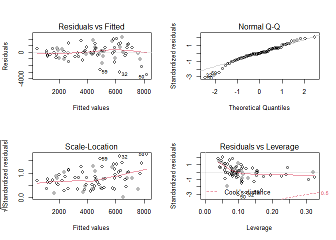<!-- -->

Training the linear regression model using the training data:

``` r
trctrl <- trainControl(method = "repeatedcv", number=10, repeats=3)
Lin_reg_1_train <- train(count ~ ., data = day_data_Train_sub, 
                 method='lm',
                 trControl=trctrl,
                 preProcess=c("center", "scale"))
```

``` r
#Predict the response variable using the test data to evaluate model performance
Lin_reg_1_predict <- predict(Lin_reg_1_train, newdata = day_data_Test_sub)

#The rmse will be shown in the model comparison table below
```

#### Second linear regression Model

From the first linear model fitted on the training set on Monday, we
found that the most statistically significant predictors are `yr` (year)
and `temp` (temperature). So in the second linear regression model, I
decided to only kept this 2 variables, while considering their
interaction term plus the polynomial terms of `temp`.

I decided to use the cross validation to figure out which polynomial
terms set from 1 to 10 perform the best.

``` r
N <- 7
cv.error <- rep(0,N)

## Fit the model without poly term
glm.fit=glm(count ~ yr*temp, data=day_data_Train)
cv.error[1]=cv.glm(data=day_data_Train,glm.fit)$delta[1]

## Fit the model that has the poly term
for(i in 2:N){
glm.fit=glm(count ~ yr*temp + poly(temp,i), data=day_data_Train)
cv.error[i]=cv.glm(data=day_data_Train,glm.fit)$delta[1]
}

## Found out the model with smallest cv error
cv.min <- which.min(cv.error)
cv.min.value <- cv.error[which.min(cv.error)]

## Save the best model
Lin_reg_2_train <- glm(count ~ yr*temp + poly(temp,cv.min), data=day_data_Train)

ggplot(data = NULL, aes(x=1:N,y=cv.error)) + geom_line() + theme_bw() + labs(x='poly terms', y = 'cv.error', title = 'CV errors vs poly terms') + geom_point(aes(x=cv.min, y=cv.min.value), color = 'red', size = 3)
```

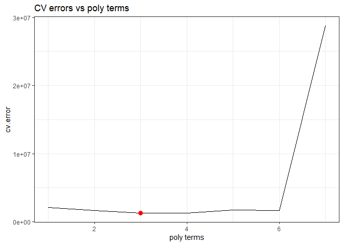<!-- -->

Above shows the trend between cross-validation errors with poly terms.
From the plot we know that the best selected model is **count \~ yr +
temp + temp:yr + poly(temp,3)**.

### Ensemble Tree Model

#### First Ensemble Tree Model: Random Forest Model

We’ll be using a Random Forest as my ensemble method. It works by
creating a number of decision trees from bootstrap samples using the
training data set, with no interaction between the trees, and aggregates
the result from these trees before outputting the most optimal result.
*mtry* is used as the tuning parameter, this is the number of variables
randomly sampled at each split. The number of variables to use in the
model is selected by 10-fold repeated cross validation from the `caret`
package using accuracy as the metric.

``` r
trctrl <- trainControl(method = "repeatedcv", number=10, repeats=3)
rf_grid <- expand.grid(mtry = 1:11)
rf_train <- train(count ~., 
                 data= day_data_Train_sub, 
                 method='rf', 
                 trControl=trctrl,
                 tuneGrid = rf_grid,
                 preProcess=c("center", "scale"))


#Predict the response variable using the test data to evaluate model performance
rf_predict <- predict(rf_train, newdata = day_data_Test_sub)

#The rmse will be shown in the model comparison table below
```

#### Second Ensemble Tree Model: Boosted Tree Model

For a small data set, we want to try boosted tree regression in order to
avoid the problem of overfitting. We want to use the method **Gradient
Boosting Machines**, which has lots of flexibility and can be provided
several hyperparameter tuning options that make the function fit very
flexible.

The methods/process in this part are come from an online website: [click
here](http://uc-r.github.io/gbm_regression).

``` r
# create hyperparameter grid
hyper_grid <- expand.grid(
  shrinkage = c(.01, .1, .3),
  interaction.depth = c(1, 3, 5),
  n.minobsinnode = c(5, 10, 15),
  bag.fraction = c(.65, .8, 1), 
  optimal_trees = 0,               # a place to dump results
  min_RMSE = 0                     # a place to dump results
)
```

First we created a data frame of each hyperparameter, and we would like
to loop through each hyperparameter combination and apply 5,000 trees.

Since our training set is not large enough, and the number of
observations are not constant among Monday to Sunday (I didn’t check
that and it’s just my assumption), I didn’t perform a 5-fold or 10-fold
CV, but instead I train on 95% of the training observations and evaluate
performance on the remaining 5%. That’s means for a training set which
have 100 oberservations, it will do the same as a 5-fold CV; for a
training set with 80 observations, it will do the same as a
80 × 0.05 = 4 fold CV.

Noticed that when using `train.fraction` it will take the first *X**X*%
of the data so I need to randomize the training set first in case
there’s a logic behind the ordering of the data (i.e. ordered by date).

``` r
set.seed(23)
# randomize data
random_index <- sample(1:nrow(day_data_Train_sub), nrow(day_data_Train_sub))
random_train <- day_data_Train_sub[random_index, ]

# grid search 
for(i in 1:nrow(hyper_grid)) {
  
  # reproducibility
  set.seed(123)
  
  # train model
  gbm.tune <- gbm(
    formula = count ~ .,
    distribution = "gaussian",
    data = random_train,
    n.trees = 5000,
    interaction.depth = hyper_grid$interaction.depth[i],
    shrinkage = hyper_grid$shrinkage[i],
    n.minobsinnode = hyper_grid$n.minobsinnode[i],
    bag.fraction = hyper_grid$bag.fraction[i],
    train.fraction = .95,
    n.cores = NULL, # will use all cores by default
    verbose = FALSE
  )
  
  # add min training error and trees to grid
  hyper_grid$optimal_trees[i] <- which.min(gbm.tune$valid.error)
  hyper_grid$min_RMSE[i] <- sqrt(min(gbm.tune$valid.error))
}

hyper_grid <- hyper_grid %>% 
  dplyr::arrange(min_RMSE) 
hyper_grid %>%
  head(10)
```

Above shows the details of the expand grid ranged by RMSE. Since we
selected the best `shrinkage`, `interaction.depth` and so on,

I decided to dive deeper about the number of trees (max=10000) by these
winned hyperparameters and selected the model by 5-fold CV.

``` r
set.seed(123)
# train GBM model
gbm.fit.final <- gbm(
    formula = count ~ .,
    distribution = "gaussian",
    data = random_train,
    n.trees = 5000,
    interaction.depth = hyper_grid$interaction.depth[1],
    shrinkage = hyper_grid$shrinkage[1],
    n.minobsinnode = hyper_grid$n.minobsinnode[1],
    bag.fraction = hyper_grid$bag.fraction[1],
    cv.folds = 5,
    n.cores = NULL, # will use all cores by default
    verbose = FALSE
)

## Predict
pred <- predict(gbm.fit.final, n.trees = gbm.fit.final$n.trees, day_data_Test_sub)
boosted_RMSE <- caret::RMSE(pred, day_data_Test_sub$count)

gbm.perf(gbm.fit.final, method = "cv")
```

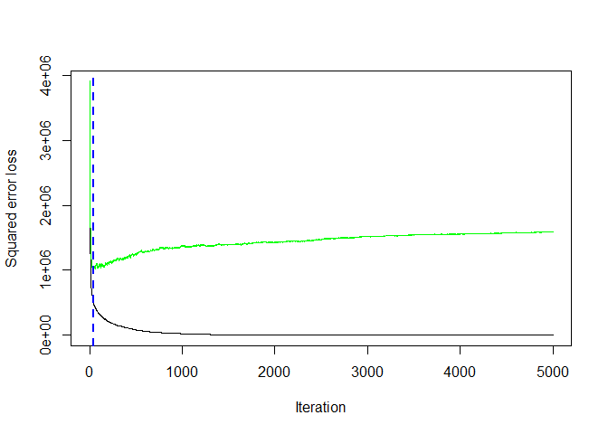<!-- -->

    ## [1] 39

Above shows the trend of cross-validation error with number of trees. At
trees equal to 39 we get the minimum error rate 997.0422351, which may
be a better representation of the error we might expect on the test data
set.

### Model Comparison

The four models (2 linear regression models, one random forest model and
one boosted tree model) are compared below.The RMSE is used as the basis
for comparison.

``` r
library(ModelMetrics)

Result <- data.frame(method = c('Full Linear', 'Subset Linear', 'Random Forest', 'Boosted Tree'), RMSE = rep(NA,4))

Result$method <- as.character(Result$method)

Result$RMSE[1] <- rmse(predict(Lin_reg_1_train, day_data_Test_sub), day_data_Test_sub$count)

Result$RMSE[2] <- rmse(predict(Lin_reg_2_train, day_data_Test_sub), day_data_Test_sub$count)

Result$RMSE[3] <- rmse(predict(rf_train$finalModel, day_data_Test_sub), day_data_Test_sub$count)

Result$RMSE[4] <- boosted_RMSE

Result %>%
  kable(caption = 'Final Result for 4 models', digits = 2)
```

| method        |    RMSE |
|:--------------|--------:|
| Full Linear   | 1091.44 |
| Subset Linear | 1158.26 |
| Random Forest | 2709.67 |
| Boosted Tree  | 1234.12 |

Final Result for 4 models

The model with the lowest `RMSE` value is the winner. Just a quick
summary that, the **Full Linear** refers to the linear model contains
all the 8 variables (season, yr, month, holiday, weathersit, temp,
humidity, windspeed) after we selected first. The **Subset Linear** is a
polynomial linear regression contains the interaction term of `yr` and
`temp`. The **Random Forest** and the **Boosted Tree** are 2 ensemble
models.

Here, the winner belongs to the Full Linear model.
